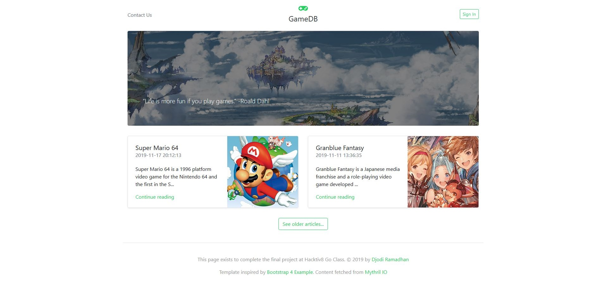

# go-final-project

This project exists to complete the final assignment in Go Class at Hacktiv8

```
You have to GIT Clone -> Install DB -> go mod tidy before running this web service.
```

## Sign-In Web Page
```Sign-In Web Page
Email : djodi.ramadhan@gmail.com
Password : lalala11
```

## Home Page
Users will see this by the first time they landing to this website. Users may click "See more arciles..." to load more articles.


## About Page
Users will see this when they click developer's name on the bottom of the web page.


## Contact Page
Users will see this when they click "Contact Us" link on the top-left of the web page. Some fields are required.


## Sign In Page
Users will see this when they click "Sign In" link on the top-right of the web page. They may see "Manage Articles" & "See Feedback" after they signed-in successfully.


## Manage Articles Page
Users will see this when they click "Manage Articles" link on the top-left of the web page. They may create new, update, delete, publsh or unpublish selected articles.

